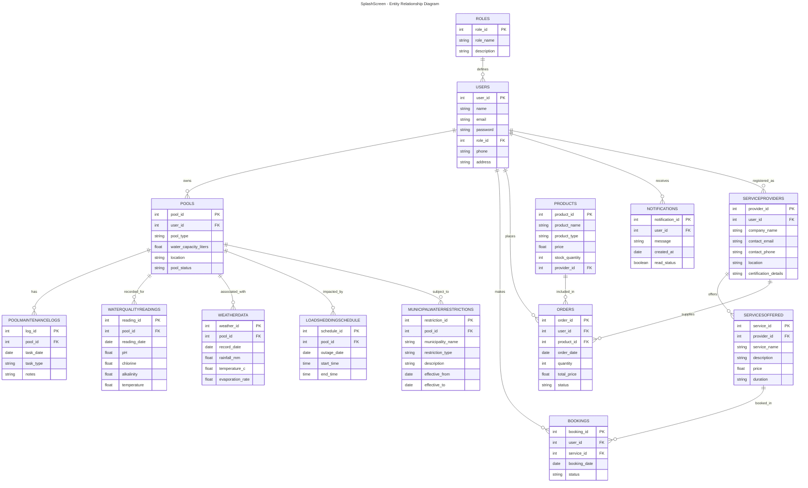

# The Ripple Effect presents SplashScreen

A mobile platform designed to help residential pool owners in South Africa maintain their pools efficiently while reducing water waste, lowering costs, and connecting them with trusted local service providers.
>[!Tip]
>Version aplha 1.1 is ready for testing. Download the apk [here](https://splashscreen-20z.pages.dev/).

---

---

## Table of Contents
1. [Project Overview](#project-overview)
2. [Problem Domain](#problem-domain)
3. [Project Members](#project-members)
4. [Objectives](#objectives)
5. [Features](#features)
6. [System Architecture](#system-architecture)
7. [Database Design](#database-design)
8. [Workflow](#workflow)
9. [Technology Stack](#technology-stack)
10. [Installation](#installation)
11. [Usage](#usage)
12. [Contributing](#contributing)
13. [License](#license)
14. [Future Enhancements](#future-enhancements)

---

## Project Overview

SplashScreen is a solution tailored to the unique challenges faced by South African pool owners. The system combines:

- DIY water quality monitoring.
- Digital maintenance guidance.
- A transparent service marketplace connecting homeowners with verified providers.

This platform addresses the **Pool Maintenance Dilemma** by reducing inefficiencies, saving time and water, and improving overall reliability for homeowners.

---

## Problem Domain

South Africa faces an ongoing water scarcity crisis, with an average annual rainfall of only 464 mm, significantly below the global average of 860 mm. Urban and suburban municipalities often impose strict water restrictions and higher tariffs. 

There are approximately 800,000 residential swimming pools, each requiring 30,000 to 60,000 litres of water. The main challenge is not the existence of pools, but their inefficient and inconsistent maintenance, which can result in water waste, costly mistakes, and missed regulatory compliance.  

Key challenges include:

- **Maintenance Complexity**: Balancing pH, chlorine, and alkalinity, especially with interruptions like load shedding.  
- **Time Constraints**: Busy homeowners, frequent travellers, and holiday property owners often rely on professional services.  
- **Scattered Service Market**: Finding reliable, verified service providers is challenging, as platforms are decentralized.  

---

### Project Members

This project was completed by the following group members:

- **Line Redpath**  
   
   GitHub Profile: [Line's GitHub](https://github.com/LRedpathZA)  

- **Juanette Viljoen**  
   
   GitHub Profile: [Juanette's GitHub](https://github.com/JuanetteRViljoen)  

- **Tinotenda Mhedziso**  
   
  GitHub Profile: [Tino's GitHub](https://github.com/Passion-Over-Pain)

---
## Objectives

- Provide a locally tailored, DIY pool maintenance tool.
- Track water quality and maintenance history.
- Integrate weather, load shedding, and municipal restriction data for intelligent guidance.
- Create a centralised marketplace for service providers and pool products.
- Minimise water waste and improve homeowner compliance with regulations.
- Offer service providers a structured platform to grow their business.

---

## Features

**For Pool Owners:**
- Register and manage multiple pools.
- Record water quality measurements.
- Receive alerts for chemical maintenance, load shedding, and municipal restrictions.
- Schedule professional service bookings.
- Purchase chemicals and equipment directly from providers.

**For Service Providers:**
- Create profiles and list services offered.
- Manage bookings and product sales.
- Receive customer reviews and ratings.

**System Features:**
- Centralised notifications and reminders.
- Integration with weather and load-shedding APIs.
- Compliance tracking with municipal water restrictions.

---

## System Architecture

SplashScreen follows a **mobile-first architecture** leveraging Firebase:

1. **Frontend**: Mobile interfaces built in **Java using Android Studio**, designed for homeowners and service providers.  
2. **Backend / Cloud Services**: **Firebase** handles authentication, database management (Firestore), serverless functions (Cloud Functions), and notifications (Cloud Messaging).  
3. **Database**: **Firestore** stores users, pools, services, products, water quality logs, municipal restrictions, and maintenance history.  

---

## Database Design

Key entities and relationships:

- **Users & Roles**: Differentiate homeowners, providers, and admins.  
- **Pools**: Linked to users, store physical characteristics and location.  
- **PoolMaintenanceLogs**: Records maintenance tasks.  
- **WaterQualityReadings**: Stores pH, chlorine, alkalinity, and temperature measurements.  
- **WeatherData**: Tracks rainfall, temperature, and evaporation for pools.  
- **LoadSheddingSchedule**: Tracks power outages for pump operation.  
- **MunicipalWaterRestrictions**: Stores restrictions by area.  
- **ServiceProviders & ServicesOffered**: Marketplace offerings.  
- **Bookings & Orders**: Tracks service appointments and product purchases.  
- **Products**: Pool chemicals, equipment, and tools.  
- **Notifications**: Reminders and alerts for users.

---

## Workflow

### Pool Owner Workflow
1. Register account → add pool(s).  
2. Enter or sync water quality readings.  
3. Receive automated recommendations or reminders.  
4. Browse service marketplace or purchase products.  
5. Schedule professional maintenance if needed.  
6. Receive notifications for load shedding, weather changes, or water restrictions.

### Service Provider Workflow
1. Register account → verify identity.  
2. List services and products.  
3. Accept bookings and track orders.  
4. Receive reviews and maintain a service rating.

### System Workflow
- Backend calculates chemical recommendations based on water readings and weather data.  
- Alerts and reminders are triggered based on maintenance schedules, municipal restrictions, and load shedding.  
- Marketplace connects homeowners with providers and tracks bookings and orders.  

---

## Technology Stack

- **Mobile Application**: Java, Android Studio
- **Backend**: Firebase (Authentication, Firestore Database, Cloud Functions, Cloud Messaging)
- **Notifications**: PostgreSQL (or MySQL)  
- **APIs**: Weather API, Load Shedding Schedule API
- **Version Control**: GitHub
---

## Installation

**Coming Soon**

## Usage

- Register as a **homeowner** or **service provider** within the app.  
- Add your pool(s) and manually record water quality readings or maintenance logs.  
- Receive notifications and reminders for chemical adjustments, municipal water restrictions, and load shedding events.  
- Browse the service marketplace to book professional maintenance or purchase chemicals and equipment.  
- Track historical maintenance data, monitor water usage, and follow suggested best practices for pool upkeep.  

---

## Contributing

*Not Applicable for now.*
---

## License

This project is licensed under the MIT License. See the [LICENSE](LICENSE) file for full details.  

---

## Future Enhancements

- **IoT Sensor Integration**: Enable automated water quality monitoring via smart sensors.  
- **AI-Based Recommendations**: Provide predictive chemical adjustments and maintenance guidance.  
- **Payment Gateway Integration**: Support in-app purchases for chemicals, equipment, and service bookings.  
- **Multi-Language Support**: Expand accessibility across different South African languages.  
- **Gamification and Rewards**: Encourage sustainable water usage through points or achievement systems.  

